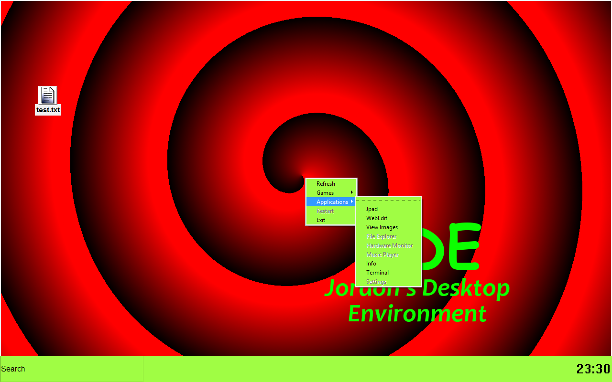

# JDE
Jordon's Desktop Environment is a complete rewrite of Glass OS which was one of my previous programs I made.

## What is JDE?
JDE stands for "Jordon's Desktop Environment" and is a complete rewrite of Glass OS which was another desktop environment. This means that JDE is NOT an operating system but is a overlay on top of your existing desktop.
## What are the requirements?
Well, JDE will work on any computer that is capable of running python 3. This means that even the tiny device you call a "raspberry pi" can run it!

PS: Right Click for the start menu.

Disclaimer: JDE has NOT been tested on mac, many linux distributions or windows 8.1 and below.
